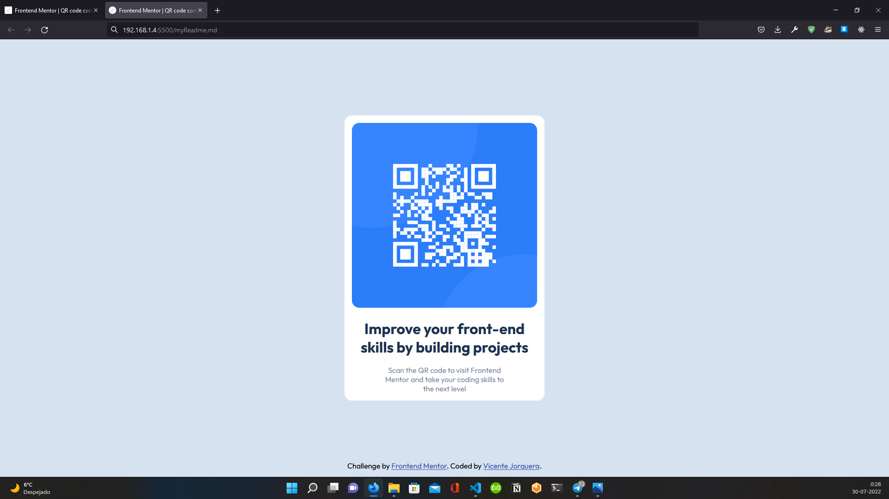

# Frontend Mentor - QR code component solution

This is a solution to the [QR code component on Frontend Mentor](https://www.frontendmentor.io/challenges/qr-code-component-iux_sIO_H). Frontend Mentor challenges help you improve your coding skills by building realistic projects.

## Table of contents

- [Overview](#overview)
    - [Screenshoot](#screenshot)
    - [Links](#links)
- [My process](#my-process)
    - [Built with](#built-with)
- [Autor](#autor)

## Overview

### Screenshot

### Links

- Solution URL: [Solution](https://github.com/VicenteJ20/100daysofcode/tree/main/FontEnd_Mentor/QR_code_component)
- Live site URL: [GO LIVE](https://jvicente20-qr-code-components.netlify.app)

## My process

1) I created a "Main" tag where I added an internal "div" with a class called "myCard".

2) Inside "myCard" I added all the elements.

3) I used relative units to give responsive design, you can see the code in the files of this repository.

4) I made a "div" to host the corresponding attribution and I took it out of the document flow with the properties "position: fixed; bottom: 1rem;", this way the attribution will always be at the bottom of the page.

Translated with www.DeepL.com/Translator (free version)

## Built with
- HTML 5
- CSS3
- FLEXBOX
- RESPONSIVE WEB DESIGN

## Author
- Personal website [https://vicentejorquera.netlify.app](https://vicentejorquera.netlify.app)

- Frontend Mentor  [@VicenteJ20](https://www.frontendmentor.io/profile/VicenteJ20)

- Twitter [@jvicente_20](https://www.twitter.com/jvicente_20)