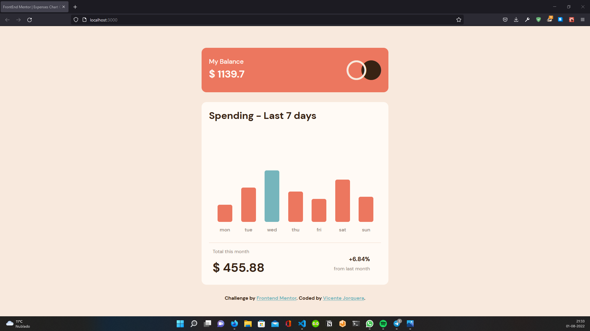

# Frontend Mentor - Expenses chart component solution

This is a solution to the [Expenses chart component challenge on Frontend Mentor](https://www.frontendmentor.io/challenges/expenses-chart-component-e7yJBUdjwt). Frontend Mentor challenges help you improve your coding skills by building realistic projects. 

## Table of contents

- [Overview](#overview)
    - [Screenshoot](#screenshot)
    - [Links](#links)
- [Built with](#built-with)
- [Autor](#autor)

## Overview

All values are operations! there isn't any static value!

### Screenshot

### Links

- Solution URL: [Solution](https://github.com/VicenteJ20/100daysofcode/tree/main/FontEnd_Mentor/expenses-chart-component)
- Live site URL: [GO LIVE](https://jvicente20-expenses-chart-component.netlify.app/)

## Built with
- React
- Bootstrap
- HTML 5
- CSS3
- FLEXBOX
- RESPONSIVE WEB DESIGN
- FontAwesome ICONS

## Author
- Personal website [https://vicentejorquera.netlify.app](https://vicentejorquera.netlify.app)

- Frontend Mentor  [@VicenteJ20](https://www.frontendmentor.io/profile/VicenteJ20)

- Twitter [@jvicente_20](https://www.twitter.com/jvicente_20)